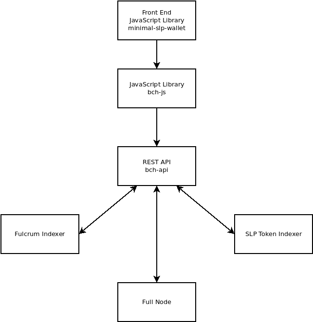

# bch-api

[](https://github.com/Permissionless-Software-Foundation/bch-js/blob/master/LICENSE.md)
[](https://github.com/feross/standard)

This is a REST API server, written in node.js JavaScript, using the [Express.js](https://expressjs.com/) framework. The purpose of this code is to create a REST API server that provides a common interface for developers to build blockchain-based business applications. This software works with the Bitcoin Cash (BCH) and eCash (XEC) blockchains.
- High-level documentation is available on [CashStack.info](https://cashstack.info).

While developers are encouraged to run and manage their own infrastructure, cloud-based infrastructure is available via [FullStack.cash](https://fullstack.cash). Free and paid tiers are available. You can use this REST API right away with the [bch-js](https://github.com/Permissionless-Software-Foundation/bch-js) JavaScript library.

This repository is intended to be paired with [bch-js](https://github.com/Permissionless-Software-Foundation/bch-js), an npm JavaScript library for building Bitcoin Cash apps. [Code examples](https://github.com/Permissionless-Software-Foundation/bch-js-examples) for common use-cases are available, and the [minimal-slp-wallet](https://www.npmjs.com/package/minimal-slp-wallet) is a front end JavaScript library that incorporates bch-js and provides basic wallet functionality.



## Documentation
All the software above is part of the [Cash Stack](https://cashstack.info).

- [CashStack](https://cashstack.info) high-level documentation.
- [bch-api REST API reference](https://api.fullstack.cash/docs/)
- [bch-js JavaScript API reference](https://bchjs.fullstack.cash/)
- [bch-js example code](https://github.com/Permissionless-Software-Foundation/bch-js-examples)
- [Additional documentation on FullStack.cash](https://fullstack.cash/documentation)
- [Additional examples on FullStack.cash](https://fullstack.cash/examples)

Have questions? Need help? Join our community support:
- [Telegram channel](https://t.me/bch_js_toolkit)

### Configure bch-js
The live servers can be used by [bch-js](https://github.com/Permissionless-Software-Foundation/bch-js) by settings the `restURL` config property to one of these servers:

- BCH Mainnet REST API server: https://bchn.fullstack.cash/v5/
- eCash Mainnet REST API server: https://abc.fullstack.cash/v5/
- Check server status: https://metrics.fullstack.cash

## Installation
There are two installation paths, depending if you want a *development* or
*production* environment. You'll also need to set up the underlying infrastructure
described on [CashStack.info](https://cashstack.info).

This hardware target for this software is a PC running Ubuntu 18.04 LTS Linux OS or higher.

### Development
This is a standard node.js project. The installation is as follows:

- Clone this repository:

`git clone https://github.com/Permissionless-Software-Foundation/bch-api && cd bch-api`

- Install dependencies:

`npm install`

- Customize the [start-dev-example.sh](start-dev-example.sh) shell script to
point to the required infrastructure. Start the bch-api REST API by running
this script:

`./start-dev-example.sh`

### Production
For a production environment, a Docker container is provided in the
[docker](docker) directory. One for mainnet and one for testnet. Again, these
containers target the Ubuntu 18.04 LTS Linux OS.

- Install Docker and Docker Compose by following the commands on
[this Dev Ops page](https://bafybeidpuq6pgpryd22wwykhqh2etw44pzofuncm5ldczk5v733tkwk55y.ipfs.dweb.link/docs/dev-ops/overview).

- Customize the [bash script](docker/mainnet/start-local-mainnet.sh) for your
installation.

- Build the Docker container with:

`docker-compose build --no-cache`

- Run the Docker container with:

`docker-compose up -d`

## Rate Limits
Rate limiting of the REST API can be controlled in three different ways:
 - JWT tokens for individual users
 - Basic Authentication tokens for organization-wide usage.
 - Whitelisting for specific domain names

### JWT Tokens
The rate limits for [api.fullstack.cash](https://api.fullstack.cash) are controlled by a JWT token. You can increase your rate limits by [purchasing a JWT token](https://fullstack.cash). If you're using bch-js, [check the readme for instructions on increasing rate limits](https://github.com/Permissionless-Software-Foundation/bch-js#api-key). For interacting with bch-api directly (without bch-js), you can then include the JWT token in the HTTP header like this:

- `Authorization: Token <JWT token>`

### cURL example
Here is an example using curl for using the JWT token when making a call to the REST API:

```
export BCHJSTOKEN=eyJhbGciOiJ....

curl "https://bchn.fullstack.cash/v4/electrumx/balance/bitcoincash:qr69kyzha07dcecrsvjwsj4s6slnlq4r8c30lxnur3" -X GET -H "Content-Type: application/json" -H "Authorization: Token ${BCHJSTOKEN}"
```

### Basic Authentication
For private installations, Basic Authentication can be used to give everyone in an organization access to higher rate limits, while restricting use by the public. More than one Basic Authentication password can be generated by using the colon `:` to separate entries in the `PRO_PASS` environment variable. See the [bash script](docker/mainnet/start-local-mainnet.sh) for an example.

### Whitelists
Website domain names can be added to the `WHITELIST_DOMAINS` environment variable. Multiple domains can be separated with a comma `,`. Any web app making a request from that domain will be granted top-level rate limits. See the [bash script](docker/mainnet/start-local-mainnet.sh) for an example.

## Donate

This open source software is developed and maintained by the [Permissionless Software Foundation](https://psfoundation.cash). If this library provides value to you, please consider making a donation to support the PSF developers:

<div align="center">

<p>bitcoincash:qqsrke9lh257tqen99dkyy2emh4uty0vky9y0z0lsr</p>
</div>


## Censorship Resistance
Copies of this repository will occasionally be uploaded and hosted on the Filecoin blockchain, [IPFS](https://ipfs.io), and the [Radicle](https://radicle.xyz) p2p network.

- v1.25.1: [QmXFzFJHenymhReDc9oGAxbpmvK2fJYnisQ2pJn3gGyKKX](https://ipfs.io/ipfs/QmXFzFJHenymhReDc9oGAxbpmvK2fJYnisQ2pJn3gGyKKX)

## License
[MIT](./LICENSE.md)
