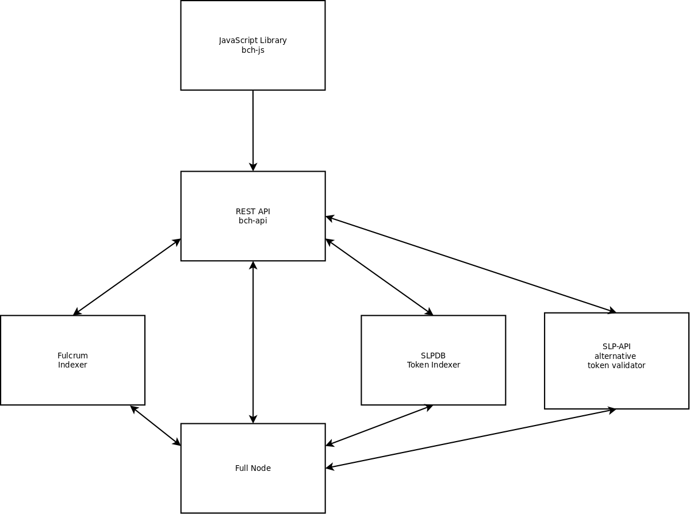

# bch-api

[](https://github.com/Permissionless-Software-Foundation/bch-js/blob/master/LICENSE.md)
[](https://github.com/feross/standard)

This is a REST API server, written in node.js JavaScript, using [Express.js](https://expressjs.com/) framework. The purpose of this code is to create a REST API server that provides a common interface for working with a Bitcoin Cash full node and various indexers. See [this article](https://psfoundation.cash/blog/cash-stack) to learn about the 'Cash Stack'. Visit [FullStack.cash](https://fullstack.cash), sign up for a free account, and use this REST API right away with the [bch-js](https://github.com/Permissionless-Software-Foundation/bch-js) JavaScript library.

This repository is intended to be paired with [bch-js](https://github.com/Permissionless-Software-Foundation/bch-js), an npm JavaScript library for building Bitcoin Cash apps.



Both bch-api and bch-js are part of the 'Cash Stack' [full stack of BCH software](https://troutsblog.com/research/bitcoin-cash/how-to-bch-full-stack-developer).

- [API Documentation](https://fullstack.cash/documentation)
- [Example Code](https://fullstack.cash/examples)

Have questions? Need help? Join our community support:
[Telegram channel](https://t.me/bch_js_toolkit)

## Features
The following features set this repository apart from rest.bitcoin.com:

- Fine grain access is controlled with a JWT token using
[this back end auth server](https://github.com/Permissionless-Software-Foundation/jwt-bch-api) and [this front end](https://github.com/Permissionless-Software-Foundation/jwt-bch-frontend). Can be used to monetize access to the REST API.
- Typescript removed and ES8 JavaScript used instead.
- `npm audit fix` frequently run to fix dependencies.

## Live Demo
You can test a live demo of the REST API by running the
[bch-js examples](https://github.com/Permissionless-Software-Foundation/bch-js-examples).
Rate limits are 20 requests per minute, but you can increase them to 100 with a [paid account](https://fullstack.cash/pricing).
You can bootstrap your own REST API server by downloading and installing the infrastructure listed on the [CashStrap](https://fullstack.cash/cashstrap) page.

### Configure bch-js
The live servers can be used by [bch-js](https://github.com/Permissionless-Software-Foundation/bch-js) by settings the `restURL` config property to one of these servers:

- BCHN Mainnet REST API server: https://bchn.fullstack.cash/v4/
- ABC Mainnet REST API server: https://abc.fullstack.cash/v4/
- Testnet3 REST API server: https://testnet3.fullstack.cash/v4/
- Check server status: https://metrics.fullstack.cash

## Installation
There are two installation paths, depending if you want a *development* or
*production* environment. You'll also need to set up the underlying infrastructure
described on [this page](https://psfoundation.cash/blog/cash-stack).

This code targets the Ubuntu 18.04 LTS Linux OS or higher.

### Development
This is a standard node.js project. The installation is as follows:

- Clone this repository:

`git clone https://github.com/Permissionless-Software-Foundation/bch-api && cd bch-api`

- Install dependencies:

`npm install`

- Customize the [start-dev-example.sh](start-dev-example.sh) shell script to
point to the required infrastructure. Start the bch-api REST API by running
this script:

`./start-dev-example.sh`

### Production
For a production environment, a Docker container is provided in the
[docker](docker) directory. One for mainnet and one for testnet. Again, these
containers target the Ubuntu 18.04 LTS Linux OS.

- Install Docker and Docker Compose by following the commands on
[this Dev Ops page](https://troutsblog.com/research/dev-ops/overview).

- Customize the [bash script](docker/mainnet/start-local-mainnet.sh) for your
installation.

- Build the Docker container with:

`docker-compose build --no-cache`

- Run the Docker container with:

`docker-compose up`

## Rate Limits
The rate limits for [api.fullstack.cash](https://api.fullstack.cash) are controlled by a JWT token. You can increase your rate limits by [purchasing a JWT token](https://https://fullstack.cash). If you're using bch-js, [check the readme for instructions on increasing rate limits](https://github.com/Permissionless-Software-Foundation/bch-js#api-key). For interacting with bch-api directly, you can then include the JWT token in the HTTP header like this:

- `Authorization: Token <JWT token>`

### cURL example
Here is an example using curl for using the JWT token when making a call to the REST API:

```
export BCHJSTOKEN=eyJhbGciOiJ....

curl "https://bchn.fullstack.cash/v4/electrumx/balance/bitcoincash:qr69kyzha07dcecrsvjwsj4s6slnlq4r8c30lxnur3" -X GET -H "Content-Type: application/json" -H "Authorization: Token ${BCHJSTOKEN}"
```

## Support
Have questions? Need help? Join our community support
[Telegram channel](https://t.me/bch_js_toolkit)

## IPFS
Copies of this repository will occasionally be uploaded and hosted on [IPFS](https://ipfs.io):

- v1.25.1: [QmXFzFJHenymhReDc9oGAxbpmvK2fJYnisQ2pJn3gGyKKX](https://ipfs.io/ipfs/QmXFzFJHenymhReDc9oGAxbpmvK2fJYnisQ2pJn3gGyKKX)

## License
[MIT](./LICENSE.md)
a
